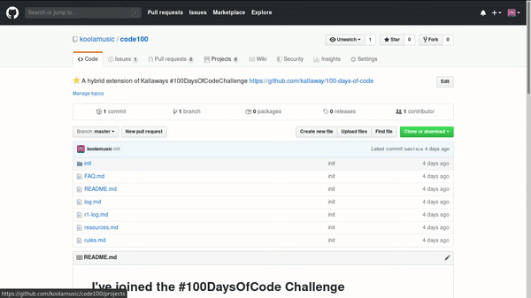

# Welcome to the #100DaysOfCode Challenge

This is :star: A hybrid extension of Kallaways #100DaysOfCodeChallenge https://github.com/kallaway/100-days-of-code

## Contents

* [Rules](rules.md)
* [Log - click here to see my progress](log.md)
* [FAQ](FAQ.md)
* [Resources](resources.md)

## If you've decided to join:

Check out [the Official Site](http://100daysofcode.com/) for the #100DaysOfCode movement.

1. Read [Join the #100DaysOfCode](https://medium.freecodecamp.com/join-the-100daysofcode-556ddb4579e4)
2. Click the `Use this template` button to create a copy of this repo on your [Github](https://github.com) Account and commit to the [Log](log.md) everyday of the challenge, check the [guides](guides) folder for a list of how to related to git and github.
3. Setup a Goals Tracker using the Issues or Project Board to create Milestones

4. **Code minimum an hour every day for the next 100 days.**
5. Change the date in [Rules](rules.md) and [Log](log.md) to the day you've started the challenge.
6. Delete the examples in the log, or comment them out, and start filling it with your own content.
7. **Optionally Tweet your progress every day using the #100DaysOfCode hashtag.**
8. Follow [100DaysOfCode](https://twitter.com/_100DaysOfCode) Twitter Bot that retweets the tweets that contain the #100DaysOfCode hashtag. It's a great way to keep yourself motivated and to participate in the community. Thanks [@amanhimself](https://twitter.com/amanhimself) for creating it!
9. Important: (see No.4 above for a specific rule on this) Encourage others who are doing the same challenge on Twitter or elsewhere - by giving them props when they are posting updates on their progress, supporting them when things get difficult. Thus we will grow a community that is helpful and effective, which will lead to a higher success rate for each person involved. It's also more likely that you will stick to your own commitment, given that you will get acquainted with a couple people (or more) right away.

## Want to change other habits?

Check out [the #100DaysOfX Challenges Project](http://100daysofx.com/). Changing your habits you are changing your life. Remember that the best time to start is always NOW.

## Note

* If you like this repo and find it useful, please consider &#9733; starring it (on top right of the page) and forking it :)
